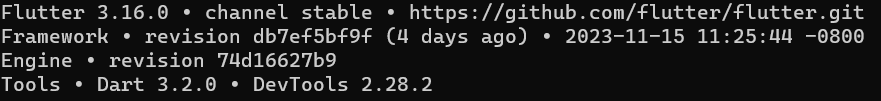
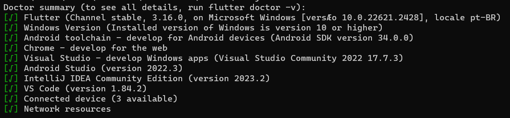
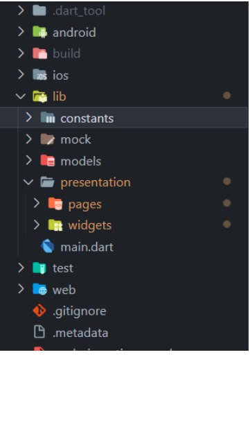
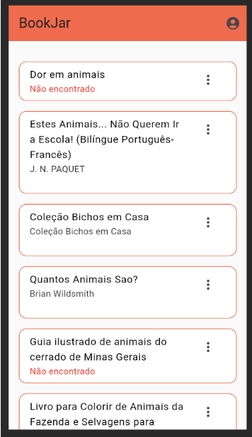
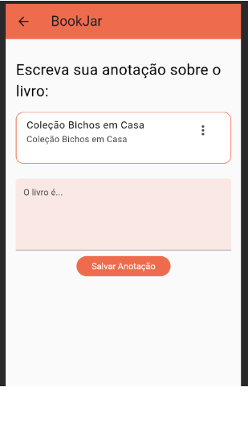
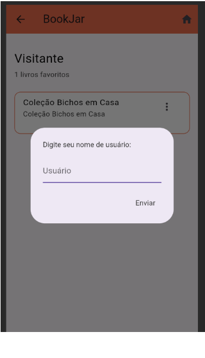
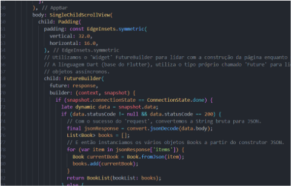

# Projeto Flutter BookJar

### Participantes

- Ana Paula Tartari
- Beatriz Calazans
- Gean Carlos Almeida

### Professor

- Mario Jorge Pereira

### Matéria

- Programação para Dispositivos Móveis

---

## Introdução

Este projeto foi desenvolvido como parte da matéria de Programação para Dispositivos Móveis, ministrada na Universidade Catolica de Salvador (UCSal) sob a orientação do Professor Mario Jorge. O objetivo é criar uma aplicação móvel utilizando Flutter, que é um framework de código aberto da Google para a criação de interfaces de usuário para plataformas móveis e web.

---

## Como Instalar o Projeto Flutter

Este guia simplificado ajuda você a instalar o Flutter no Windows. Para detalhes completos, visite a [documentação oficial](https://docs.flutter.dev/get-started/install/windows).

### Requisitos do Sistema

- Sistema operacional: Windows 7 SP1 ou posterior (64-bit)
- Espaço em disco: 1.64 GB (não inclui espaço para IDE/ferramentas).
- Ferramentas necessárias: Windows PowerShell 5.0 ou mais recente (incluído no Windows 10), Git para Windows 2.x.

### Passos para Instalação

1. **Baixe o Flutter SDK:**
    - Acesse o [arquivo de versões do Flutter SDK](https://flutter.dev/docs/development/tools/sdk/releases) e baixe a versão mais recente do Flutter SDK para Windows.
    - O download será um arquivo `.zip`. Após o download, extraia o conteúdo desse arquivo.
    - Escolha um local apropriado no seu computador para extrair os arquivos, seguindo as seguintes recomendações:
        - Não instalar em pastas que contenham caracter especial e/ou espaço.
        Ex: `C:\dev flutter` ou `C:\dev_flutter!`.
        - Escolher um local que não exija privilégios de administrador para modificações. Portanto, evite locais como `C:\Program Files\`

    - Após escolher o local, extraia o conteúdo do arquivo `.zip` para lá. Isso criará uma pasta `flutter` no diretório escolhido, contendo todos os arquivos necessários do SDK do Flutter.
    &nbsp;

2. **Atualize o Path do Sistema:**
   - Para que as ferramentas do Flutter sejam acessíveis a partir da linha de comando em qualquer diretório, você precisa adicionar o caminho do Flutter SDK ao Path do sistema.
   - Primeiro, localize o caminho completo onde você extraiu o Flutter SDK e copie o caminha ate a pasta `bin`. Por exemplo, se você extraiu o Flutter em `C:\src\flutter\bin`, este é o caminho que você usará.
   - Em seguida, siga estes passos para atualizar o Path do sistema:
     1. No menu Iniciar, procure por 'Configurações do Sistema' e selecione 'Editar as variáveis de ambiente do sistema'.
     2. Na janela 'Propriedades do Sistema', clique em 'Variáveis de Ambiente'.
     3. Em 'Variáveis de Sistema', procure a variável chamada 'Path' e selecione-a. Clique em 'Editar'.
     4. Na janela de edição, clique em 'Novo' e cole o caminho completo para o diretório `flutter\bin`. Por exemplo, `C:\src\flutter\bin`.
     5. Clique em 'OK' para fechar cada uma das janelas.
   - Após adicionar o Flutter ao Path, você precisará reiniciar qualquer prompt de comando aberto ou reiniciar o sistema para que as alterações entrem em vigor.
   - Para verificar se o Path foi configurado corretamente, abra um novo prompt de comando e digite `flutter --version`. Se o Flutter estiver corretamente instalado, você verá a versão do Flutter exibida.
   
    &nbsp;

3. **Execute o Flutter Doctor:**
    O comando `flutter doctor` é uma ferramenta de linha de comando que verifica automaticamente se o seu ambiente de desenvolvimento está configurado corretamente para o desenvolvimento com Flutter.

   Para executar esta ferramenta:
   - Abra um prompt de comando (ou um terminal, se estiver usando um editor de código como o VSCode).
   - Digite o comando `flutter doctor` e pressione Enter. O Flutter irá executar uma série de verificações para detectar se há alguma dependência faltando ou algum problema de configuração no seu ambiente de desenvolvimento.
   - A saída do comando mostrará um relatório detalhado. Por exemplo, ele pode indicar se você precisa instalar ou configurar um Android SDK, se há problemas com a instalação do Xcode (para desenvolvimento iOS), ou se você precisa instalar ou atualizar plugins.
   - Siga as instruções e recomendações fornecidas pelo `flutter doctor`. Se houver algum problema identificado, o comando geralmente oferece uma descrição clara do problema e sugestões sobre como resolvê-lo.
   - Uma vez que todas as verificações estejam mostrando um status de sucesso (geralmente indicado por um sinal de check verde), seu ambiente estará pronto para desenvolver aplicações Flutter.
   - É uma boa prática executar `flutter doctor` regularmente para garantir que seu ambiente de desenvolvimento esteja sempre atualizado e configurado corretamente.
   
    &nbsp;

   >**Atenção!**
   Se você não possuir o Android Studio ou o Android SDK instalados em sua máquina, ao utilizar o flutter doctor pela primeira vez, você será informado sobre a necessidade de instalar o Android toolchain.
   Para resolver siga os passos do proximo topico

## Configuração do Android

Para desenvolver aplicativos Flutter para a plataforma Android, algumas configurações adicionais são necessárias. Essas etapas garantem que você tenha todas as ferramentas necessárias para construir e testar seus aplicativos no Android.

Se você preferir uma instalação mais enxuta e não planeja usar o Android Studio, é possível optar por instalar apenas o Android SDK. No entanto, para manter este guia conciso e evitar complicações que podem surgir com uma instalação mínima, focaremos exclusivamente na instalação utilizando o Android Studio.

1. **Instale o Android Studio:**
   - O Android Studio é a IDE recomendada para desenvolvimento Flutter no Android. Ele inclui ferramentas essenciais como o Android SDK e o emulador Android.
   - Baixe o Android Studio do [site oficial](https://developer.android.com/studio).
   - Siga as instruções de instalação fornecidas no site. Durante a instalação, certifique-se de marcar as opções para instalar o 'Android SDK', 'Android SDK Platform' e 'Android Virtual Device'.

2. **Configurar o Emulador Android:**
   - O Android Studio inclui um emulador que permite simular diferentes dispositivos e versões do Android.
   - Abra o Android Studio, vá até 'AVD Manager' e configure um emulador Android de sua escolha.
   - Certifique-se de escolher uma imagem de sistema que corresponda à versão mínima do Android suportada pelo Flutter (atualmente, API 18, Android 4.3).
   - Após configurar, inicie o emulador para garantir que ele esteja funcionando corretamente.

3. **Verifique a Configuração com o Flutter Doctor:**
   - Execute `flutter doctor` no terminal para garantir que o Android Studio esteja configurado corretamente para o desenvolvimento Flutter.
   - O Flutter Doctor verificará se o Android Studio, o Android SDK e o emulador estão configurados corretamente.

Após esses passos, seu ambiente de desenvolvimento Flutter deve estar pronto para você começar a criar projetos!

## Desenvolvimento

O desenvolvimento desse projeto foi realizado incrementalmente e as etapas definidas foram baseadas nas principais tarefas e features do projeto. Apesar dos commits apresentarem esse progresso, vamos descrever como ocorreu as principais etapas do desenvolvimento.

### Etapas de Desenvolvimento

1. **Idealização e Prototipação:**
    - A princípio, após receber os requisitos e sugestões de temas do projeto, foi preciso interpretar todas as funcionalidades e idear a imagem do projeto.
    
    - Projetamos a ideia utilizando o [figma](https://www.figma.com/file/zDyZJhrINYnVscqYskA7AR/BookJar?type=design&node-id=1109-355&mode=design&t=Ac54Ek2YoQrPutEo-0) e para nortear o início do desenvolvimento e facilitar a visão comum do app entre os integrantes da equipe.
    &nbsp;

2. **Configuração e Criação das Estruturas do Projeto:**
   - Nessa etapa criamos o projeto utilizando a extensão do VSCode para definir atributos de projeto como: plataformas suportadas (android, ios, web), nome do app da loja, etc.
    &nbsp;

    
    &nbsp;

3. **Features:**
    a. **Página Inicial (HomePage):**
      - Nessa etapa, deixamos a criação mais crua e simples da tela inicial para dar ênfase no entendimento e consumo da API do Google Books.
      - Também foram criadas as classes de outras ‘features’ mas neste momento era somente o suficiente para ser testado com a Home.
    &nbsp;

    
    &nbsp;

   b. **Página de Anotações (AddNotePage):**
      - Nessa etapa, desenvolvemos a segunda página do aplicativo, responsável por adicionar anotações aos objetos de Livro da biblioteca.
      - A princípio, como ainda não existia tela de favoritos (equivalente à tela de perfil), fizemos somente o visual da tela, sua funcionalidade mais básica (atualizar um livro) e a navegação através dos botões da tela inicial.
    &nbsp;

    
    &nbsp;

   c. **Página de Perfil (ProfilePage):**
      - Nessa etapa, com a construção de todas as telas do app, tivemos que fazer alterações e adaptações nas outras telas para comportar o fluxo de navegação completo.
      - Além disso, outro desafio foi persistir os dados dessa página para o usuário durante aquela sessão, tentamos a leitura e manipulação de um arquivo JSON porém por questões de prazo e dificuldades, optamos por outra opção mais simples.
    &nbsp;

    
    &nbsp;

   d. **Ajustes Finais e Finalização:**
      - Com todo o projeto funcionalmente finalizado, separamos um momento somente para adicionar comentários, esclarecimento das funcionalidades e ‘faxina’ do código.
    &nbsp;

    
    &nbsp;
